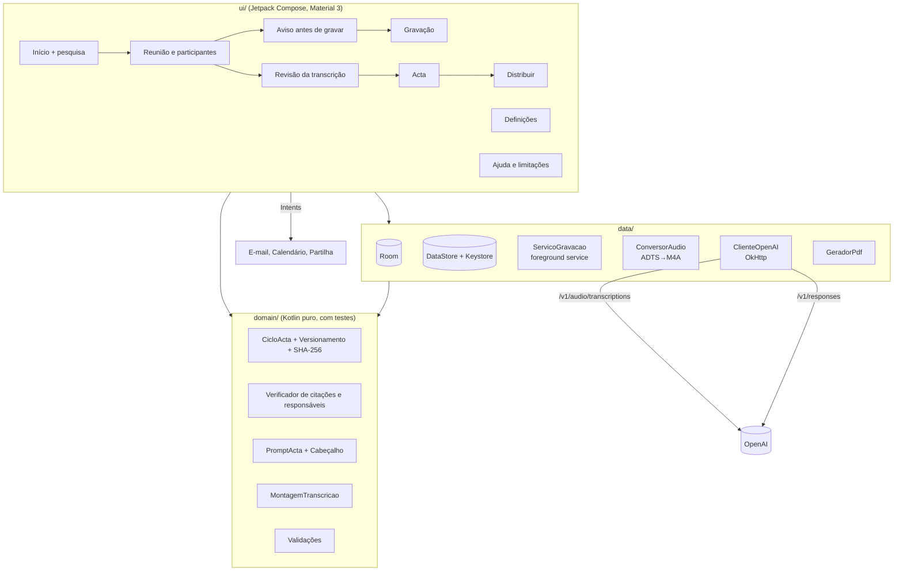

# ACTA — Assistente de Captura, Transcrição e Arquivo de Reuniões

App Android (MVP) que grava reuniões, transcreve identificando quem fala, gera a acta com resumo e plano de ações,
envia a acta por e-mail aos participantes e agenda a próxima reunião no calendário.

> Projeto académico do módulo de Engenharia de IA (Skodji Digital), baseado na especificação EF-ACTA-2026-001 v1.0.
> Toda a interface está em português.

## Funcionalidades

- **Reuniões e participantes**: e-mail e telefone (E.164) validados, presença (Presente/Ausente/Justificado/Representado) e consentimento com data e hora.
- **Aviso antes de gravar**: quatro confirmações obrigatórias e alerta com o nome de quem não deu consentimento.
- **Gravação**:
  - serviço em primeiro plano do tipo microfone, com notificação persistente;
  - AAC ADTS mono, 16 kHz, 64 kbps, em partes de 5 minutos;
  - pausa, e pausa automática durante chamadas, com retoma no fim da chamada;
  - recuperação do áudio após terminação anómala;
  - verificação de 500 MB livres antes de começar e sinal sonoro ao iniciar.
- **Transcrição com diarização** (`gpt-4o-transcribe-diarize`): um pedido por parte, conversão ADTS→M4A sem recodificar e repetição só da parte que falhou.
- **Revisão**:
  - filtro por orador;
  - edição do texto com registo de autor, instante e texto anterior;
  - associação dos rótulos (P1-A, P2-B…) a participantes, com propagação a todos os segmentos;
  - tempo de intervenção de cada orador.
- **Acta**:
  - os dados de identificação vêm da base de dados; o LLM gera o resto com saída estruturada (JSON Schema);
  - a verificação em código confirma cada citação nos segmentos indicados;
  - itens não verificados ficam a âmbar, e ações sem responsável claro ficam "Por atribuir";
  - súmula executiva de 250 palavras no máximo;
  - menção obrigatória de IA.
- **Ciclo de vida**: RASCUNHO → EM_REVISÃO → APROVADA → DISTRIBUÍDA. A aprovação fixa o conteúdo e calcula o SHA-256; alterar depois cria uma nova versão.
- **PDF** com a menção de IA e o hash no rodapé. **E-mail** pelo cliente do telemóvel, com confirmação "O e-mail foi enviado?". **Partilha nativa**. **Calendário**.
- **Pesquisa** em títulos, transcrições e actas. **Leitura em voz** (TextToSpeech em português) com velocidade e volume.
- **Segurança**:
  - bloqueio biométrico ao abrir;
  - chave da API cifrada com o Android Keystore;
  - dados excluídos das cópias de segurança;
  - "Apagar todos os dados" com dupla confirmação.
- **Modo demonstração**: reunião fictícia já processada, para testar sem chave de API.

## Arquitetura



## Instalar o APK

1. No GitHub, abra **Releases** e descarregue o ficheiro `app-debug.apk` da versão mais recente.
   Em alternativa, abra **Actions → Build APK → última execução → Artifacts → acta-apk**.
2. No telemóvel (Android 8.0 ou superior), abra o ficheiro e aceite **instalar apps de origem desconhecida** para o navegador ou gestor de ficheiros.
3. As versões seguintes instalam-se por cima da anterior sem perder dados (ver "Porque é que o `debug.keystore` está no repositório").

Para publicar uma Release com o APK anexado: **Releases → Draft a new release**, crie uma tag (por exemplo `v1.0.0`) e publique.
O workflow compila e anexa o APK automaticamente.

## Modo demonstração (sem chave de API)

No primeiro arranque, toque em **"Explorar com uma reunião de exemplo"**. Também pode carregá-la em **Definições → Carregar reunião de exemplo**.
A reunião é **fictícia**, está marcada como tal e inclui:
- 4 participantes (3 presentes, 1 com falta justificada);
- cerca de 15 minutos de transcrição com 3 oradores, em 3 partes;
- uma acta em rascunho com 3 deliberações e 5 ações, uma delas "Por atribuir".

Sem chave pode testar: revisão (edição, associação de oradores, tempos), acta (edição, "Ver origem", aprovação, versões), PDF,
distribuição por e-mail, calendário, pesquisa e leitura em voz. A gravação funciona sem chave, mas a transcrição e a geração de acta precisam dela.
Para apagar os dados fictícios: **Definições → Apagar dados de exemplo**.

## Configurar a chave da API

1. Crie uma conta em <https://platform.openai.com>, **carregue saldo** (a API é paga por utilização) e crie uma chave em *API keys*.
2. Na app: **Definições → Chave da API da OpenAI**, cole a chave e toque em **Guardar**.
3. A chave é cifrada com AES-256/GCM usando uma chave do Android Keystore, que não sai do hardware seguro.
   Nunca aparece no código, no repositório nem nos logs.

Modelos usados: `gpt-4o-transcribe-diarize` na transcrição e `gpt-6-sol` na acta (este último pode ser alterado em Definições).

## Porque é que o `debug.keystore` está no repositório

Cada execução do GitHub Actions criaria uma chave de assinatura debug nova. O Android recusa instalar um APK assinado com uma chave
diferente por cima do anterior, o que obrigaria a desinstalar e a perder os dados. Por isso, `app/debug.keystore` está no repositório
e o `signingConfig` debug usa-o.

**Não é um segredo:** usa as credenciais debug convencionais do Android (`android` / `androiddebugkey`) e só assina builds de teste.
Nunca deve ser usado para publicar na Play Store.
Foi gerado com `openssl` (formato PKCS12, CN=Android Debug, válido por 30 anos), porque o `keytool` não estava disponível no ambiente onde o projeto foi criado.
Se for preciso recriá-lo com o `keytool` do JDK (o primeiro APK assinado com a chave nova terá de ser instalado depois de desinstalar o anterior):

```bash
keytool -genkeypair -v -keystore app/debug.keystore -storetype PKCS12 -storepass android -alias androiddebugkey -keypass android -keyalg RSA -keysize 2048 -validity 10950 -dname "CN=Android Debug,O=Android,C=US"
```

## Compilar

O build é feito pelo GitHub Actions (`.github/workflows/build-apk.yml`) em cada push. O workflow:
1. gera o Gradle wrapper, se faltar;
2. corre os testes unitários;
3. compila o APK debug;
4. guarda o APK como artefacto e anexa-o às Releases.

Localmente, com Android Studio ou JDK 17 + Android SDK:

```bash
gradle wrapper --gradle-version 9.6.0
```

```bash
./gradlew testDebugUnitTest assembleDebug
```

## Testes no telemóvel (paragens das Fases 3, 4 e 7)

Estes pontos dependem do microfone, da API e das apps do telemóvel. Só se validam num aparelho real:

| # | Teste | Resultado esperado |
|---|---|---|
| G1 | Gravar 1 minuto com o ecrã bloqueado | O cronómetro continua; a notificação "A gravar" fica visível; a parte aparece na reunião |
| G2 | Gravar mais de 5 minutos | Aparecem 2 partes; na revisão surge a marca de mudança de parte |
| G3 | Receber uma chamada durante a gravação | A gravação pausa ("chamada em curso") e retoma sozinha ao desligar; surge a marca "Chamada telefónica" |
| G4 | Pausar e retomar manualmente | Marca "Pausa" com início e fim; o cronómetro para durante a pausa |
| G5 | Revogar a permissão do microfone durante a gravação (Definições do Android) | O Android fecha a app; ao reabrir, a sessão aparece como "interrompida" e as partes gravadas estão disponíveis |
| G6 | Tentar gravar com menos de 500 MB livres | Mensagem de espaço insuficiente |
| T1 | Transcrever uma gravação curta (2 a 3 min, 2 pessoas) | Segmentos com P1-A/P1-B e tempos coerentes |
| T2 | Transcrever sem rede / com chave errada | Mensagem clara; botão "Repetir esta parte" |
| A1 | Gerar a acta de uma gravação com mais de 60 s de fala | Acta em rascunho; os itens com citação correta aparecem verificados |
| E1 | Aprovar e distribuir por e-mail | O cliente de e-mail abre com destinatários, assunto, corpo e PDF; ao regressar aparece "O e-mail foi enviado?" |
| C1 | Agendar a próxima reunião | A app de calendário abre com título, data e convidados preenchidos |
| V1 | Ouvir a acta | Leitura em português; se não houver voz pt, aparece a indicação de onde a instalar |

## Documentação

- [docs/REQUISITOS-MVP.md](docs/REQUISITOS-MVP.md): requisitos incluídos e excluídos
- [docs/LIMITACOES.md](docs/LIMITACOES.md): limitações e motivos
- [docs/JUSTIFICACAO-FERRAMENTA.md](docs/JUSTIFICACAO-FERRAMENTA.md): escolha da ferramenta
- [docs/PROGRESSO.md](docs/PROGRESSO.md): progresso por fase e relatório final
- [docs/registo-comandos.md](docs/registo-comandos.md): comandos executados
